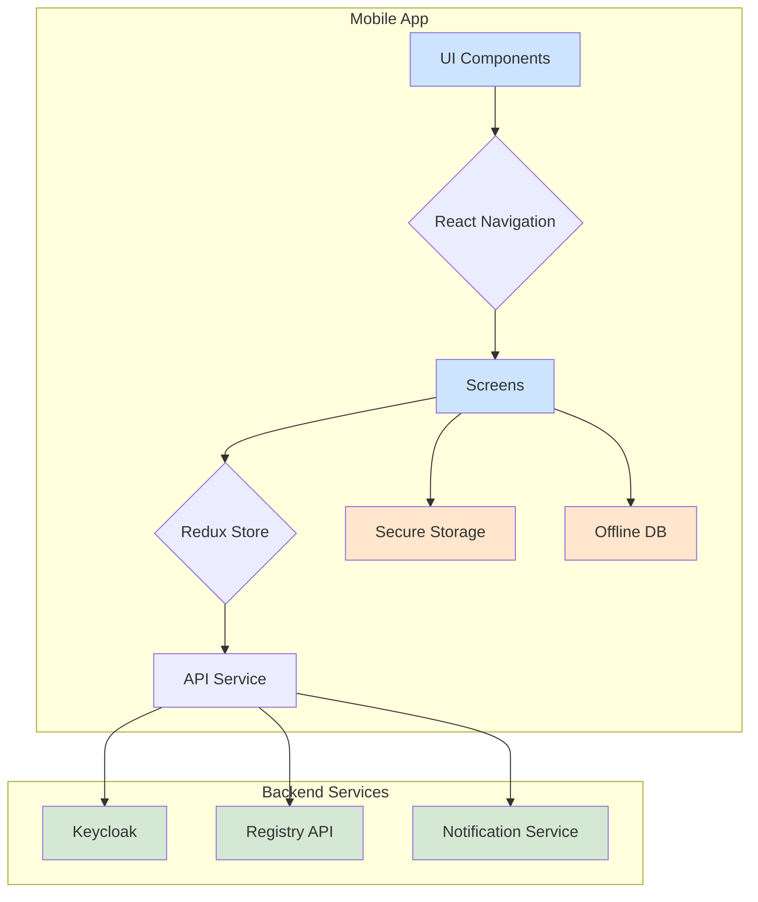

_This document is intended for the mobile development team. It outlines the technical requirements for building the HealthFlow mobile application, following best practices from Sunbird RC and the broader industry._

# HealthFlow Mobile App - Technical Requirements Document

**Document Version:** 1.0  
**Author:** Manus AI  
**Date:** January 3, 2026  
**Status:** Final

---

## 1. Overview

The HealthFlow mobile application will serve two primary user groups:

1.  **Healthcare Professionals:** Providing a secure digital wallet (eLocker) to manage their professional identity, view and present verifiable credentials (VCs), and receive real-time notifications.
2.  **Public Users & Verifiers:** Enabling the public, employers, and authorities to instantly verify the authenticity of a professional's credentials by scanning a QR code.

The application must be built for both iOS and Android platforms, ensuring a consistent, secure, and user-friendly experience.

### 1.1 Key Features

| Feature | User Group | Description |
|---|---|---|
| **Digital Wallet (eLocker)** | Professionals | Securely store, view, and manage all issued verifiable credentials. |
| **QR Code Generation** | Professionals | Generate a dynamic QR code for each credential to present for verification. |
| **Real-time Notifications** | Professionals | Receive instant alerts for credential issuance, expiration warnings, and system announcements. |
| **Profile Management** | Professionals | View and manage personal and professional information. |
| **Offline Access** | Professionals | Access and present credentials even without an internet connection. |
| **QR Code Scanner** | Public / Verifiers | Scan a professional's QR code to get a real-time verification status from the registry. |
| **Verification History** | Public / Verifiers | Keep a local history of scanned and verified credentials. |
| **Biometric Security** | Professionals | Secure access to the digital wallet using Face ID, Touch ID, or device PIN. |

---

## 2. Technology Stack & Architecture

The mobile application will be developed using a modern, cross-platform stack to ensure code reusability and faster development cycles. The choice of technology is based on best practices observed in the Sunbird RC ecosystem and successful large-scale digital identity projects like DIVOC.

### 2.1 Recommended Technology Stack

| Component | Technology | Justification |
|---|---|---|
| **Framework** | **React Native with Expo** | Enables rapid, cross-platform development for iOS and Android from a single codebase. Expo simplifies the build process, over-the-air (OTA) updates, and access to native APIs. |
| **State Management** | **Redux Toolkit** | Provides a predictable and scalable state management solution with excellent TypeScript support, ideal for managing user sessions, credentials, and notifications. |
| **Navigation** | **React Navigation** | The community-standard library for routing and navigation in React Native apps. |
| **UI Toolkit** | **React Native Paper / NativeWind** | A combination of a Material Design component library (Paper) and a utility-first CSS framework (NativeWind for Tailwind CSS) allows for beautiful, consistent, and easily customizable UIs. |
| **QR Code Scanning** | **`react-native-vision-camera`** | A high-performance, flexible camera library that supports real-time frame processing, making it ideal for fast and accurate QR code scanning. [1] |
| **Secure Storage** | **`expo-secure-store`** | Provides encrypted storage on the device using the native Keychain (iOS) and Keystore (Android), which is the most secure method for storing sensitive data like authentication tokens. [2] |
| **Push Notifications** | **`expo-notifications`** | A comprehensive library for handling push notifications on both iOS and Android, essential for the real-time notification feature. |
| **Database (Offline)** | **WatermelonDB / Realm** | A high-performance reactive database framework that is optimized for building complex applications on React Native, with a focus on real-world performance. It will be used for caching credentials for offline access. |

### 2.2 Architecture Diagram



### 2.3 Project Structure

A well-organized project structure is crucial for maintainability. The following structure is recommended:

```
/healthflow-mobile
|-- /src
|   |-- /api                # API service definitions and configurations
|   |-- /assets             # Images, fonts, and other static assets
|   |-- /components         # Reusable UI components (e.g., CredentialCard, QRScanner)
|   |-- /constants          # App-wide constants (e.g., colors, routes)
|   |-- /hooks              # Custom React hooks (e.g., useBiometrics)
|   |-- /navigation         # Navigation stack, tab, and drawer configurations
|   |-- /screens            # Top-level screen components
|   |-- /services           # Business logic services (e.g., AuthService, CredentialService)
|   |-- /store              # Redux Toolkit store, slices, and selectors
|   |-- /utils              # Utility functions (e.g., formatters, validators)
|-- app.json                # Expo configuration file
|-- package.json
|-- tsconfig.json
```

---

## 3. Implementation Details & Best Practices

This section provides detailed requirements and code examples for key features.

### 3.1 Authentication with Keycloak

Authentication will be handled via the `RegistryAdmin` realm in Keycloak, using the OAuth 2.0 Authorization Code Flow with PKCE for security.

**Implementation:**

-   Use the `react-native-app-auth` library, which is a wrapper around AppAuth-iOS and AppAuth-Android and provides a secure and standard-compliant way to handle the OAuth flow.
-   Store the `access_token`, `refresh_token`, and `id_token` securely in `expo-secure-store`.
-   Implement a token refresh mechanism that uses the `refresh_token` to get a new `access_token` in the background without requiring the user to log in again.

**Code Example (AuthService):**

```typescript
// src/services/AuthService.ts
import { authorize, refresh, revoke } from 'react-native-app-auth';
import * as SecureStore from 'expo-secure-store';

const keycloakConfig = {
  issuer: 'https://keycloak.healthflow.tech/realms/RegistryAdmin',
  clientId: 'mobile-app', // A new client ID for the mobile app
  redirectUrl: 'com.healthflow.mobile:/oauthredirect',
  scopes: ['openid', 'profile', 'email', 'offline_access'],
};

class AuthService {
  async signIn() {
    const authState = await authorize(keycloakConfig);
    await SecureStore.setItemAsync('authState', JSON.stringify(authState));
    return authState;
  }

  async refresh() {
    const storedAuthState = await SecureStore.getItemAsync('authState');
    if (!storedAuthState) throw new Error('Not authenticated');

    const authState = JSON.parse(storedAuthState);
    const newAuthState = await refresh(keycloakConfig, {
      refreshToken: authState.refreshToken,
    });

    await SecureStore.setItemAsync('authState', JSON.stringify(newAuthState));
    return newAuthState;
  }

  async signOut() {
    const storedAuthState = await SecureStore.getItemAsync('authState');
    if (!storedAuthState) return;

    const authState = JSON.parse(storedAuthState);
    await revoke(keycloakConfig, {
      tokenToRevoke: authState.accessToken,
    });

    await SecureStore.deleteItemAsync('authState');
  }
}

export default new AuthService();
```

### 3.2 Digital Wallet & Offline Access

The digital wallet is the core feature for professionals. It must be fast, secure, and available offline.

**Implementation:**

-   On login, fetch all verifiable credentials from the backend API.
-   Store the credentials in the local offline database (WatermelonDB or Realm).
-   The UI should always read from the local database first, providing an instant-loading experience.
-   Implement a background sync mechanism to periodically update the credentials from the server.

**Data Model (Credential):**

```typescript
// src/db/models/Credential.ts
import { Model } from '@nozbe/watermelondb';
import { field, text } from '@nozbe/watermelondb/decorators';

export default class Credential extends Model {
  static table = 'credentials';

  @text('vc_jwt') vcJwt!: string;
  @field('issuer_name') issuerName!: string;
  @field('credential_type') credentialType!: string;
  @field('issued_at') issuedAt!: number;
  @field('expires_at') expiresAt?: number;
  @field('is_revoked') isRevoked!: boolean;
}
```

### 3.3 QR Code Verification

Verification must be fast and reliable. The process involves the professional generating a QR code and the verifier scanning it.

**Professional's Flow (Generation):**

1.  The user selects a credential to share.
2.  The app generates a short-lived JWT containing the credential ID and a nonce.
3.  This JWT is displayed as a QR code.

**Verifier's Flow (Scanning):**

1.  The verifier scans the QR code using the `react-native-vision-camera`.
2.  The app extracts the JWT from the QR code.
3.  The JWT is sent to the backend `/verify` endpoint.
4.  The backend validates the JWT, fetches the credential status from the registry, and returns a signed verification result.
5.  The app displays the verification result (e.g., "Valid", "Revoked", "Expired") along with key credential details.

**Code Example (QRScanner Component):**

```typescript
// src/components/QRScanner.tsx
import React from 'react';
import { Camera, useCameraDevice, useCodeScanner } from 'react-native-vision-camera';

const QRScanner = ({ onCodeScanned }) => {
  const device = useCameraDevice('back');
  const codeScanner = useCodeScanner({
    codeTypes: ['qr'],
    onCodeScanned: (codes) => {
      if (codes.length > 0) {
        onCodeScanned(codes[0].value);
      }
    },
  });

  if (!device) return <Text>No camera device found.</Text>;

  return <Camera style={StyleSheet.absoluteFill} device={device} isActive={true} codeScanner={codeScanner} />;
};
```

### 3.4 Security Best Practices

Security is paramount for an application handling sensitive identity information.

| Practice | Implementation |
|---|---|
| **Biometric Authentication** | Use `expo-local-authentication` to protect access to the wallet section. Require biometrics or device PIN before displaying credentials or generating QR codes. |
| **Root/Jailbreak Detection** | Use a library like `react-native-jail-monkey` to detect if the device is compromised. If it is, limit app functionality or prevent access to sensitive data. |
| **SSL Pinning** | Implement SSL certificate pinning to prevent man-in-the-middle (MITM) attacks. This ensures the app only communicates with the authentic HealthFlow backend. Use a library like `react-native-ssl-pinning`. |
| **Code Obfuscation** | Enable Hermes (the default JS engine for React Native) and use ProGuard (Android) and built-in iOS obfuscation to make the compiled application code harder to reverse-engineer. |
| **Secure Data Handling** | Never store sensitive data in insecure locations like AsyncStorage. Use `expo-secure-store` for tokens and the encrypted offline database for credentials. Clear clipboard after a short period if copying sensitive information. |

---

## 4. API & Backend Dependencies

The mobile app will interact with the existing HealthFlow backend services. The following endpoints will be required.

| Endpoint | Method | Description |
|---|---|---|
| `/auth/mobile/login` | POST | Initiates the mobile-specific OAuth flow. |
| `/credentials` | GET | Fetches all verifiable credentials for the authenticated user. |
| `/credentials/{id}/qr` | GET | Generates a short-lived JWT for QR code sharing. |
| `/verify` | POST | Verifies a credential JWT from a scanned QR code. |
| `/notifications` | GET | Fetches a history of notifications for the user. |
| `/notifications/read` | POST | Marks notifications as read. |

---

## 5. References

[1] React Native VisionCamera Documentation. (n.d.). Retrieved from https://react-native-vision-camera.com/

[2] Expo SecureStore Documentation. (n.d.). Retrieved from https://docs.expo.dev/versions/latest/sdk/secure-store/

[3] Sunbird RC eLocker UI. (n.d.). Retrieved from https://github.com/Sunbird-RC/sunbird-rc-elocker-ui

[4] DIVOC: Digital Infrastructure for Verifiable Open Credentialing. (n.d.). Retrieved from https://github.com/egovernments/DIVOC
